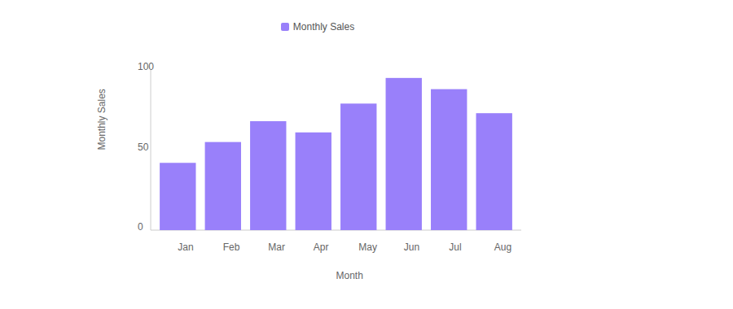
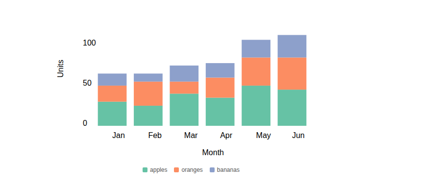
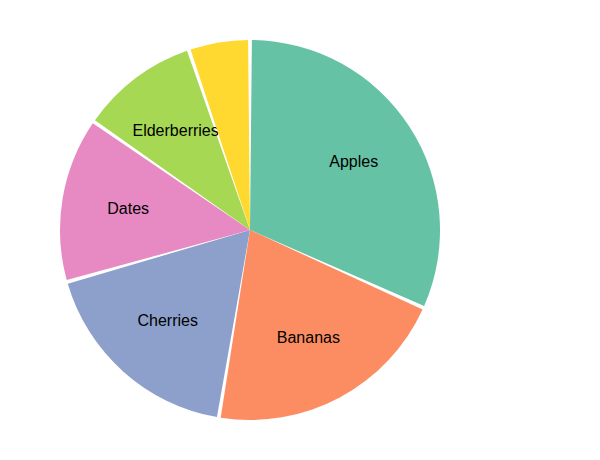
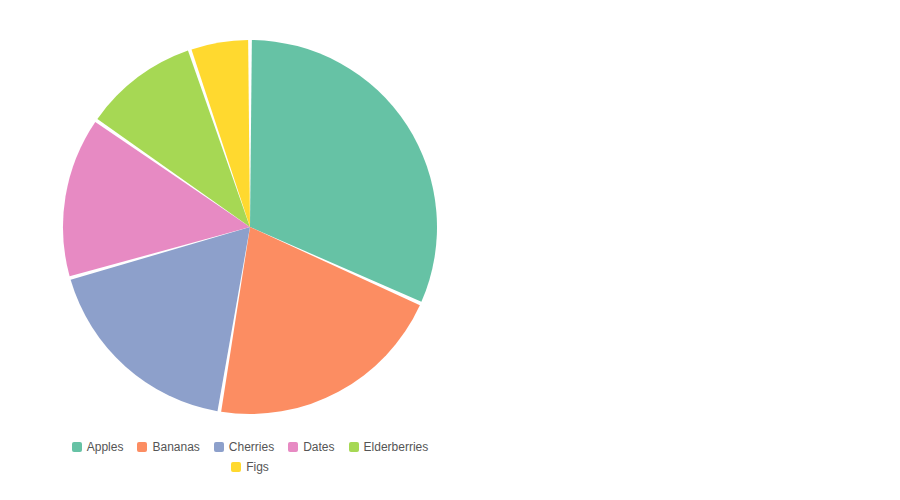

# Quick-Charts

A lightweight React + D3 chart library for building responsive, accessible data visualizations with minimal configuration.

**Charts included:**

- **Timeline** — line chart for time-series data
- **ScatterPlot** — correlation scatter chart
- **Histogram** — frequency distribution chart
- **BarChart** — categorical bar chart
- **StackedBarChart** — stacked bar chart for part-to-whole across categories
- **PieChart** — pie / donut chart for part-to-whole comparisons

## Installation

```bash
npm install quick-charts
```

## Charts

### Timeline

Renders a line chart with an optional area fill over time.

```jsx
import { Timeline } from 'quick-charts'

const data = [
  { date: new Date(2024, 2, 1), temperature: 52 },
  { date: new Date(2024, 2, 2), temperature: 58 },
  // ...
]

<div style={{ width: 560, height: 300 }}>
  <Timeline
    data={data}
    xAccessor={d => d.date}
    yAccessor={d => d.temperature}
    xLabel="Date"
    yLabel="Temperature (°F)"
    color="#e74c3c"
    showDots={true}
  />
</div>
```


| Prop | Type | Default | Description |
|------|------|---------|-------------|
| `data` | `Array` | — | Array of data objects |
| `xAccessor` | `Function` | `d => d.x` | Returns a `Date` from each datum |
| `yAccessor` | `Function` | `d => d.y` | Returns a number from each datum |
| `xLabel` | `String` | — | Label for the x-axis |
| `yLabel` | `String` | — | Label for the y-axis |
| `color` | `String` | CSS default | Line stroke color; also tints the gradient when `gradientColors` is not set |
| `gradientColors` | `String[]` | `["rgb(226,222,243)", "#f8f9fa"]` | Two-element `[topColor, bottomColor]` for the area fill gradient |
| `interpolation` | `Function` | `d3.curveMonotoneX` | D3 curve factory (e.g. `d3.curveBasis`, `d3.curveStep`) |
| `showArea` | `Boolean` | `true` | Show the filled area beneath the line |
| `showDots` | `Boolean` | `false` | Overlay a circle at each data point |
| `formatXTick` | `Function` | `d3.timeFormat("%-b %-d")` | Custom x-axis tick label formatter |
| `formatYTick` | `Function` | `d3.format(",")` | Custom y-axis tick label formatter |
| `showLegend` | `Boolean` | `false` | Show a legend with the series color and y-axis label |
| `legendPosition` | `'top'\|'bottom'\|'left'\|'right'` | `'bottom'` | Position of the legend relative to the chart |

---

### ScatterPlot

Renders a scatter plot for exploring correlations between two continuous variables.

```jsx
import { ScatterPlot } from 'quick-charts'

const data = [
  { humidity: 0.3, temperature: 55 },
  { humidity: 0.6, temperature: 72 },
  // ...
]

<div style={{ width: 560, height: 340 }}>
  <ScatterPlot
    data={data}
    xAccessor={d => d.humidity}
    yAccessor={d => d.temperature}
    xLabel="Humidity"
    yLabel="Temperature (°F)"
    color="#3498db"
    radius={6}
  />
</div>
```


| Prop | Type | Default | Description |
|------|------|---------|-------------|
| `data` | `Array` | — | Array of data objects |
| `xAccessor` | `Function` | `d => d.x` | Returns a number for the x-axis |
| `yAccessor` | `Function` | `d => d.y` | Returns a number for the y-axis |
| `xLabel` | `String` | — | Label for the x-axis |
| `yLabel` | `String` | — | Label for the y-axis |
| `color` | `String` | CSS default | Circle fill color |
| `radius` | `Number\|Function` | `5` | Circle radius in pixels, or a function `(d) => number` for variable sizing |
| `formatXTick` | `Function` | `d3.format(",")` | Custom x-axis tick label formatter |
| `formatYTick` | `Function` | `d3.format(",")` | Custom y-axis tick label formatter |
| `showLegend` | `Boolean` | `false` | Show a legend with the series color and y-axis label |
| `legendPosition` | `'top'\|'bottom'\|'left'\|'right'` | `'bottom'` | Position of the legend relative to the chart |

---

### Histogram

Renders a frequency distribution histogram, binned automatically by D3.

```jsx
import { Histogram } from 'quick-charts'

const data = [
  { humidity: 0.3 },
  { humidity: 0.55 },
  // ...
]

<div style={{ width: 560, height: 340 }}>
  <Histogram
    data={data}
    xAccessor={d => d.humidity}
    xLabel="Humidity"
    yLabel="Count"
    thresholds={12}
    color="#9b59b6"
  />
</div>
```


| Prop | Type | Default | Description |
|------|------|---------|-------------|
| `data` | `Array` | — | Array of data objects |
| `xAccessor` | `Function` | `d => d.x` | Returns a number from each datum |
| `xLabel` | `String` | — | Label for the x-axis |
| `yLabel` | `String` | `"Count"` | Label for the y-axis |
| `color` | `String` | — | Solid bar fill color; overrides `gradientColors` when set |
| `gradientColors` | `String[]` | `["#9980FA", "rgb(226,222,243)"]` | Two-element `[topColor, bottomColor]` gradient for bars |
| `thresholds` | `Number` | `9` | Target number of bins (D3 may adjust to nice values) |
| `formatXTick` | `Function` | `d3.format(",")` | Custom x-axis tick label formatter |
| `formatYTick` | `Function` | `d3.format(",")` | Custom y-axis tick label formatter |
| `showLegend` | `Boolean` | `false` | Show a legend with the series color and x-axis label |
| `legendPosition` | `'top'\|'bottom'\|'left'\|'right'` | `'bottom'` | Position of the legend relative to the chart |

---

### BarChart

Renders a vertical bar chart for comparing values across categories.

```jsx
import { BarChart } from 'quick-charts'

const data = [
  { month: 'Jan', sales: 42 },
  { month: 'Feb', sales: 55 },
  // ...
]

<div style={{ width: 560, height: 340 }}>
  <BarChart
    data={data}
    xAccessor={d => d.month}
    yAccessor={d => d.sales}
    xLabel="Month"
    yLabel="Sales"
    color="#2ecc71"
    barPadding={0.3}
    formatYTick={d => `$${d}`}
  />
</div>
```


| Prop | Type | Default | Description |
|------|------|---------|-------------|
| `data` | `Array` | — | Array of data objects |
| `xAccessor` | `Function` | `d => d.x` | Returns a category string from each datum |
| `yAccessor` | `Function` | `d => d.y` | Returns a number from each datum |
| `xLabel` | `String` | — | Label for the x-axis |
| `yLabel` | `String` | — | Label for the y-axis |
| `color` | `String` | CSS default | Bar fill color |
| `barPadding` | `Number` | `0.2` | Fractional gap between bars (0–1) |
| `formatYTick` | `Function` | `d3.format(",")` | Custom y-axis tick label formatter |
| `yMin` | `Number` | `0` | Minimum value for the y-axis domain |
| `showLegend` | `Boolean` | `false` | Show a legend with the bar color and y-axis label |
| `legendPosition` | `'top'\|'bottom'\|'left'\|'right'` | `'bottom'` | Position of the legend relative to the chart |



---

### StackedBarChart

Renders a stacked vertical bar chart for comparing part-to-whole relationships across categories. Pass a `keys` array and each key must be a numeric property on every datum.

```jsx
import { StackedBarChart } from 'quick-charts'

const data = [
  { month: 'Jan', apples: 30, oranges: 20, bananas: 15 },
  { month: 'Feb', apples: 25, oranges: 30, bananas: 10 },
  { month: 'Mar', apples: 40, oranges: 15, bananas: 20 },
  { month: 'Apr', apples: 35, oranges: 25, bananas: 18 },
]

<div style={{ width: 560, height: 340 }}>
  <StackedBarChart
    data={data}
    xAccessor={d => d.month}
    keys={['apples', 'oranges', 'bananas']}
    xLabel="Month"
    yLabel="Units"
  />
</div>
```

| Prop | Type | Default | Description |
|------|------|---------|-------------|
| `data` | `Array` | — | Array of data objects |
| `xAccessor` | `Function` | `d => d.x` | Returns a category string from each datum |
| `keys` | `String[]` | — | **Required.** Series keys to stack — each must be a numeric property on every datum |
| `colors` | `String[]` | `d3.schemeSet2` | One color per key |
| `xLabel` | `String` | — | Label for the x-axis |
| `yLabel` | `String` | — | Label for the y-axis |
| `barPadding` | `Number` | `0.2` | Fractional gap between bar groups (0–1) |
| `formatYTick` | `Function` | `d3.format(",")` | Custom y-axis tick label formatter |
| `showLegend` | `Boolean` | `true` | Show a legend with one entry per key |
| `legendPosition` | `'top'\|'bottom'\|'left'\|'right'` | `'bottom'` | Position of the legend relative to the chart |



---

### PieChart

Renders a pie or donut chart for part-to-whole comparisons. Labels are automatically hidden on slices narrower than ~20° to prevent overlap.

```jsx
import { PieChart } from 'quick-charts'

const data = [
  { label: 'Apples',   value: 32 },
  { label: 'Bananas',  value: 21 },
  { label: 'Cherries', value: 18 },
  { label: 'Dates',    value: 14 },
]

<div style={{ width: 420, height: 420 }}>
  <PieChart
    data={data}
    valueAccessor={d => d.value}
    labelAccessor={d => d.label}
  />
</div>

{/* Donut variant */}
<div style={{ width: 420, height: 420 }}>
  <PieChart
    data={data}
    valueAccessor={d => d.value}
    labelAccessor={d => d.label}
    innerRadius={0.55}
    colors={['#e74c3c', '#3498db', '#2ecc71', '#f39c12']}
  />
</div>
```



| Prop | Type | Default | Description |
|------|------|---------|-------------|
| `data` | `Array` | — | Array of data objects |
| `valueAccessor` | `Function` | `d => d.value` | Returns a numeric value from each datum — determines slice size |
| `labelAccessor` | `Function` | `d => d.label` | Returns a label string from each datum — used for color mapping and slice text |
| `colors` | `String[]` | `d3.schemeSet2` | Array of color strings for the slices |
| `innerRadius` | `Number` | `0` | Donut hole size as a fraction of the outer radius (0 = full pie, 0.5 = half donut) |
| `padAngle` | `Number` | `0.02` | Gap between slices in radians |
| `showLabels` | `Boolean` | `true` | Show label text inside each slice when `labelAccessor` is provided |
| `showLegend` | `Boolean` | `false` | Show a legend listing each slice's color and label |
| `legendPosition` | `'top'\|'bottom'\|'left'\|'right'` | `'bottom'` | Position of the legend relative to the chart |



---

## Full Example

```jsx
import React from 'react'
import { Timeline, ScatterPlot, Histogram, BarChart, StackedBarChart } from 'quick-charts'

const timelineData = Array.from({ length: 30 }, (_, i) => ({
  date: new Date(2024, 2, i + 1),
  temperature: Math.round(42 + Math.sin(i / 4.5) * 20 + i * 0.9),
}))

const scatterData = Array.from({ length: 60 }, (_, i) => ({
  humidity: 0.20 + (i / 60) * 0.65,
  temperature: Math.round(48 + (i / 60) * 38 + Math.cos(i * 1.1) * 5),
}))

const barData = [
  { month: 'Jan', sales: 42 },
  { month: 'Jun', sales: 95 },
  // ...
]

const stackedData = [
  { month: 'Jan', apples: 30, oranges: 20, bananas: 15 },
  { month: 'Feb', apples: 25, oranges: 30, bananas: 10 },
  { month: 'Mar', apples: 40, oranges: 15, bananas: 20 },
  { month: 'Apr', apples: 35, oranges: 25, bananas: 18 },
  { month: 'May', apples: 50, oranges: 35, bananas: 22 },
  { month: 'Jun', apples: 45, oranges: 40, bananas: 28 },
]

const App = () => (
  <div style={{ padding: 16 }}>
    <div style={{ width: 560, height: 300 }}>
      <Timeline
        data={timelineData}
        xAccessor={d => d.date}
        yAccessor={d => d.temperature}
        xLabel="Date"
        yLabel="Temperature (°F)"
      />
    </div>
    <div style={{ width: 560, height: 340 }}>
      <ScatterPlot
        data={scatterData}
        xAccessor={d => d.humidity}
        yAccessor={d => d.temperature}
        xLabel="Humidity"
        yLabel="Temperature (°F)"
      />
    </div>
    <div style={{ width: 560, height: 340 }}>
      <Histogram
        data={scatterData}
        xAccessor={d => d.humidity}
        xLabel="Humidity"
      />
    </div>
    <div style={{ width: 560, height: 340 }}>
      <BarChart
        data={barData}
        xAccessor={d => d.month}
        yAccessor={d => d.sales}
        xLabel="Month"
        yLabel="Sales"
      />
    </div>
    <div style={{ width: 560, height: 340 }}>
      <StackedBarChart
        data={stackedData}
        xAccessor={d => d.month}
        keys={['apples', 'oranges', 'bananas']}
        xLabel="Month"
        yLabel="Units"
      />
    </div>
  </div>
)
```

## Sizing

Each chart fills the dimensions of its **direct parent container**. Set a fixed `width` and `height` on the wrapper element to control chart size — the chart measures the container via `ResizeObserver` and adapts automatically.

```jsx
/* The chart fills this div exactly */
<div style={{ width: 600, height: 350 }}>
  <BarChart data={data} xAccessor={...} yAccessor={...} />
</div>
```

## Styling

All chart elements use predictable CSS class names you can override in your own stylesheet:

| Class | Element |
|-------|---------|
| `.Chart` | Root `<svg>` element |
| `.Axis` | Axis `<g>` group |
| `.Axis__line` | Axis baseline |
| `.Axis__tick` | Axis tick label text |
| `.Axis__label` | Axis title text |
| `.Line` | Timeline line path |
| `.Line--type-area` | Timeline area fill path |
| `.Circles__circle` | ScatterPlot / Timeline data-point circles |
| `.Bars__rect` | Histogram and BarChart bar rectangles |
| `.Legend` | Legend container |
| `.Legend__item` | Individual legend entry (swatch + label) |
| `.Legend__swatch` | Colored square swatch |
| `.Legend__label` | Label text next to the swatch |

## Contributing

Pull requests are welcome. For major changes, please open an issue first to discuss what you would like to change.

Please make sure to update tests as appropriate.

## License

[MIT](https://choosealicense.com/licenses/mit/)
