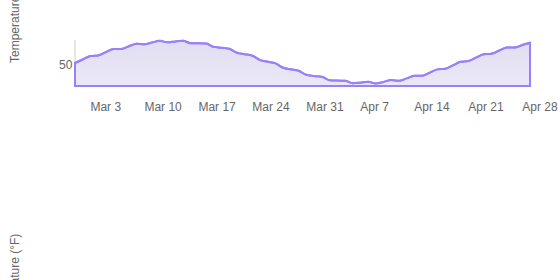
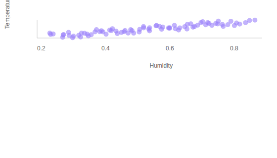
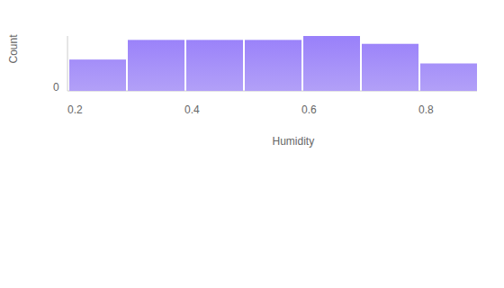
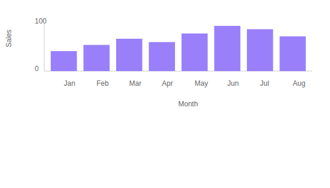

# Quick-Charts

A lightweight React + D3 chart library for building responsive, accessible data visualizations with minimal configuration.

**Charts included:**

- **Timeline** — line chart for time-series data
- **ScatterPlot** — correlation scatter chart
- **Histogram** — frequency distribution chart
- **BarChart** — categorical bar chart

## Installation

```bash
npm install quick-charts
```

## Charts

### Timeline

Renders a line chart over time. Ideal for temperature readings, stock prices, or any continuous metric against dates.

```jsx
import { Timeline } from 'quick-charts'

const data = [
  { date: new Date(2024, 2, 1), temperature: 55 },
  { date: new Date(2024, 2, 2), temperature: 60 },
  // ...
]

<div style={{ width: 560, height: 280 }}>
  <Timeline
    data={data}
    xAccessor={d => d.date}
    yAccessor={d => d.temperature}
    yLabel="Temperature (°F)"
  />
</div>
```



| Prop | Type | Required | Description |
|------|------|----------|-------------|
| `data` | `Array` | Yes | Array of data objects |
| `xAccessor` | `Function` | Yes | Returns a `Date` from each datum |
| `yAccessor` | `Function` | Yes | Returns a number from each datum |
| `xLabel` | `String` | No | Label for the x-axis |
| `yLabel` | `String` | No | Label for the y-axis |

---

### ScatterPlot

Renders a scatter plot for exploring correlations between two continuous variables.

```jsx
import { ScatterPlot } from 'quick-charts'

const data = [
  { humidity: 0.3, temperature: 55 },
  { humidity: 0.6, temperature: 72 },
  // ...
]

<div style={{ width: 560, height: 320 }}>
  <ScatterPlot
    data={data}
    xAccessor={d => d.humidity}
    yAccessor={d => d.temperature}
    xLabel="Humidity"
    yLabel="Temperature (°F)"
  />
</div>
```



| Prop | Type | Required | Description |
|------|------|----------|-------------|
| `data` | `Array` | Yes | Array of data objects |
| `xAccessor` | `Function` | Yes | Returns a number for the x-axis |
| `yAccessor` | `Function` | Yes | Returns a number for the y-axis |
| `xLabel` | `String` | No | Label for the x-axis |
| `yLabel` | `String` | No | Label for the y-axis |

---

### Histogram

Renders a frequency distribution histogram, binned automatically by D3.

```jsx
import { Histogram } from 'quick-charts'

const data = [
  { humidity: 0.3 },
  { humidity: 0.55 },
  // ...
]

<div style={{ width: 560, height: 320 }}>
  <Histogram
    data={data}
    xAccessor={d => d.humidity}
    xLabel="Humidity"
    yLabel="Count"
  />
</div>
```



| Prop | Type | Required | Description |
|------|------|----------|-------------|
| `data` | `Array` | Yes | Array of data objects |
| `xAccessor` | `Function` | Yes | Returns a number from each datum |
| `xLabel` | `String` | No | Label for the x-axis |
| `yLabel` | `String` | No | Label for the y-axis (default: `"Count"`) |

---

### BarChart

Renders a vertical bar chart for comparing values across categories.

```jsx
import { BarChart } from 'quick-charts'

const data = [
  { month: 'Jan', sales: 42 },
  { month: 'Feb', sales: 55 },
  { month: 'Mar', sales: 68 },
  // ...
]

<div style={{ width: 560, height: 320 }}>
  <BarChart
    data={data}
    xAccessor={d => d.month}
    yAccessor={d => d.sales}
    xLabel="Month"
    yLabel="Sales"
  />
</div>
```



| Prop | Type | Required | Description |
|------|------|----------|-------------|
| `data` | `Array` | Yes | Array of data objects |
| `xAccessor` | `Function` | Yes | Returns a category string from each datum |
| `yAccessor` | `Function` | Yes | Returns a number from each datum |
| `xLabel` | `String` | No | Label for the x-axis |
| `yLabel` | `String` | No | Label for the y-axis |

---

## Full Example

```jsx
import React from 'react'
import { Timeline, ScatterPlot, Histogram, BarChart } from 'quick-charts'

const timelineData = Array.from({ length: 60 }, (_, i) => ({
  date: new Date(2024, 2, i + 1),
  temperature: 55 + Math.sin(i / 8) * 18,
}))

const scatterData = Array.from({ length: 80 }, (_, i) => ({
  humidity: 0.25 + (i / 80) * 0.6,
  temperature: 45 + (i / 80) * 40,
}))

const barData = [
  { month: 'Jan', sales: 42 },
  { month: 'Feb', sales: 55 },
  { month: 'Mar', sales: 68 },
  { month: 'Apr', sales: 61 },
  { month: 'May', sales: 79 },
  { month: 'Jun', sales: 95 },
]

const App = () => (
  <div style={{ padding: 16 }}>
    <div style={{ width: 560, height: 280 }}>
      <Timeline
        data={timelineData}
        xAccessor={d => d.date}
        yAccessor={d => d.temperature}
        yLabel="Temperature (°F)"
      />
    </div>
    <div style={{ width: 560, height: 320 }}>
      <ScatterPlot
        data={scatterData}
        xAccessor={d => d.humidity}
        yAccessor={d => d.temperature}
        xLabel="Humidity"
        yLabel="Temperature (°F)"
      />
    </div>
    <div style={{ width: 560, height: 320 }}>
      <Histogram
        data={scatterData}
        xAccessor={d => d.humidity}
        xLabel="Humidity"
      />
    </div>
    <div style={{ width: 560, height: 320 }}>
      <BarChart
        data={barData}
        xAccessor={d => d.month}
        yAccessor={d => d.sales}
        xLabel="Month"
        yLabel="Sales"
      />
    </div>
  </div>
)
```

## Sizing

Each chart fills the dimensions of its container div. Set a fixed `width` and `height` on the wrapper element to control chart size. Charts automatically compute their inner margins and bounded drawing area.

## Styling

Charts use predictable CSS class names you can override in your own stylesheet:

| Class | Element |
|-------|---------|
| `.Chart` | The root `<svg>` element |
| `.Axis` | Axis group (`g` element) |
| `.Axis__line` | Axis baseline |
| `.Axis__label` | Axis label text |
| `.Line` | Timeline line path |
| `.Circles__circle` | ScatterPlot / Timeline data points |
| `.Bars__rect` | Histogram and BarChart bars |

## Contributing

Pull requests are welcome. For major changes, please open an issue first to discuss what you would like to change.

Please make sure to update tests as appropriate.

## License

[MIT](https://choosealicense.com/licenses/mit/)
